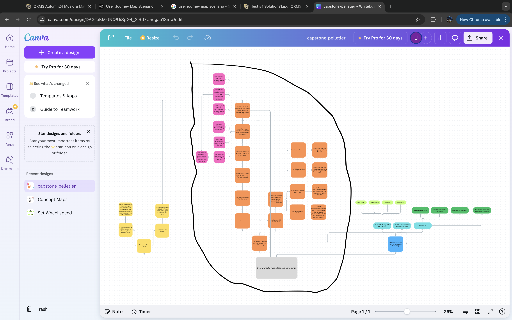

# Limit Break

## Abstract

Created with React.js and Next.js, Limit Break is a web app that allows me (the main user) to conquer my big fears and anxieties via journaling, answering guiding questions/prompts that are based on what I've been asked during past therapy sessions, and conquering smaller fears/actions that build up to said big fear. The app will also keep track of all the fears I conquer and include additional resources that are either from the web or from what I learned in past therapy sessions. In the case of an emergency (panic attacks, unescapable thoughts of hopelessness, etc.), pressing an emergency button will guide me to mental resources, along with providing a document that includes any user input added to fears, actions, and question/prompt answers. That way, when handed to a medical professional, they can have a better idea on how to assist through the current situation.

## Winter Break Progress

### My Goals for Winter Break

Considering I did not work on this project over break, I did not have any goals to accomplish, other than just recovering from the previous semester.

### My Accomplishments and Reflection on Time Management

Again, I did not work on the project over break. Because of that, my time management will need to change from recovery mode to floor-it-get-things-done mode.

### Integration of Feedback

Other than applying RMPP panel feedback (required to pass RMPP) to my project concept, no other work has been done over break.

### Learned Lessons

Because I have not worked on the project over break, I learned that working over break would've made the capstone sequence less stressful and time-consuming. Therefore, I will need to prioritize more time towards working on my project this semester.

## Project Milestones

### 30% Project Complete Mark

This progress mark will be the deadline (January 28th) for the following items:

- Entire Figma UI mock-up of Limit Break will be completed, and ready to be user-tested and critiqued
- Sufficient knowledge and practice of React.js and Next.js will be gained, that way project development can start smoothly.
    - https://www.youtube.com/watch?v=x4rFhThSX04 will be the main learning resource.

### 50% Project Complete Mark

This progress mark will be the deadline for the following items:
- Feedback from user-testing and critique will be applied to the UI of Limit Break.
- Fear-conquering part of Limit Break (the part circled on the diagram photo below) will be fully developed with React.js (front-end UI) and Next.js (database of user info and input). 

### 90% Project Complete Mark

This progress mark will be the deadline for the following items:
- All app components will be fully developed, and ready for final user-testing and critique.
- Final user-testing and critique will make room for bug fixes and final touches.

### 100% Project Complete Mark

This progress mark will be the deadline for the following items:
- Final bug fixes and touches are applied to the project, and will be ready for Expo.

## Week 1 Goals

These are the goals that should be completed by next week:
- Using feedback from the ATLS 4630 prototype of Limit Break, create a Figma mockup that shows the UI and functionality of the circled part of the diagram from the picture above. 
    -   Be sure to let users test out the process of doing the process above. Do they understand what the app is telling them to do? What are the difficulties that users will run into? Use feedback for re-iterations.
    -   At the very minimum, this can be done as a paper prototype.
- Keep following the React tutorial, and if possible, add the learned techniques to the overall project. Think of how this can be added to the project functionality.
- Start learning how to add databases with Next.js.

## Week 1 Progress

My goals for last week were the following:
- Using feedback from the ATLS 4630 prototype of Limit Break, create a Figma mockup that shows the UI and functionality of the circled part of the diagram from the picture above. 
    -   Be sure to let users test out the process of doing the process above. Do they understand what the app is telling them to do? What are the difficulties that users will run into? Use feedback for re-iterations.
    -   At the very minimum, this can be done as a paper prototype.
- Keep following the React tutorial, and if possible, add the learned techniques to the overall project. Think of how this can be added to the project functionality.
- Start learning how to add databases with Next.js.

I was able to accomplish the following:
- I came up with a new design for my app. I felt critical of my old design, looked at inspirations of other mobile app UIs, and implemented the design on Figma. So far, it is still a work-in-progress because my time management was finicky last week.
    -   No user-testing was done last week. Fortunately this week I have more opportunities (fencing meetings start, a lot of users for testing) to do that. The design just needs to be completed by the end of the 21st. Although I was able to reflect on the previous design and re-iterate.
- I followed a new react tutorial and learned the following new topics
    - Proper react directory structure (have a folder for components, pages, json files, assets, etc.)
    - Knowing the proper use of useEffect (if you want to re-render a component a fixed number of times)
    - Implementing APIs to React projects
    - Loading components when using API
    - The proper usage of dynamic rendering
    - I will plan to start implementing these concepts to my project this week.
- I learned that a Next.js intergration to my project will need an adjustment on how I use the React network routing tool.

I integrated feedback by doing a re-iteration of the app's design, after not feeling confident with my previous one. 

I learned that it will take more time to complete a full Figma prototype, so a lot of my time until the 28th will need to be focused on that.

## Week 2 Goals
- These are the goals that should be completed by next week:
    - Complete the entire UI in Figma. As you complete certain parts, perform user testing on those things. Avoid trying to be a perfectionist on this. When in doubt, just go straight into testing.
    - Continue practicing React. Get more confident with your skills.
        - As you build the static main menu and go further into development, you may run into skill issues that should be remedied via the React documentaion and tutorials (YouTube, Stack Overflow, etc.)
    -  Try completing a tutorial for Next.js.

## HX/UX Testing Round 1

Part 1

- Starting Deliverables 
    -   Design Mock-Up of Current Iteration of App Prototype
        - I want to be confident with which design I should stick with. Therefore, out of a couple design templates, I'll ask the user which one they like the most.
    -   High-Fidelity Digital Prototype
        - Before testing the entire UI, have users test out current prototype components/iterations.

- UX Testing Type with Stakeholders
    - In terms of design critique, reach out to faculty members and fellow CTD students and get their feedback.
    - With other college students as the stakeholders, perform a usability interview where they will test out the following (via High-Fidelity Figma Prototype):
        - Main Menu
            - Do they understand how the main menu works? Will it require an introductory tutorial?
        - Break Your Limits
            - Have users explain what they know as they go through this feature.
                - Do they understand each UI component? Do they understand how this feature is supposed to flow?
                - Document whenever a user is lost, and redirect/assist them.
        - Strengthen Your Knowledge
            -   Do users understand this app's feature? Have them explain what they know.
            - Do they feel that the resources may be of benefit to them in any way?
        - Track Your Journey
            - Do users understand this app's feature? Have them explain what they know.
        - Overall App flow
            - Can users navigate through the apps with minimal assistance? Note any edge cases that show up.
            - Make sure there are no points where the user gets stuck in the app.

Part 2
- I showed my current UI design to a fellow CTD student, which they felt they had no extra feedback to give, other than pointing out that the current UI looks a lot more better than the previous one.
- A user (college student; original demographic before audience changed) tested out the user experience. This involved me directing them through the app and seeing how they navigate the app with minimal assistance. As they went through the experience, I took notes of the following:
    - User was able to select the correct menu option for facing fears.
    - On the fear/step creation page, the user sticks with one step, and presses finish. 
    - User doesn't now what what to do when on the main fear facing page (Break Your Limits), and then proceeds to click on the tutorial button.
    - The tutorial explanation allowed the user to be guided through "Break Your Limits".
    - When on the confidence rating / prompt questions part of "Break Your Limits", the user didn't know how to go back to the page's main feature. They proceeded to press the hamburger menu to try and go back, and thought that "Track Your Journey" was the correct option to go back. 
        - User says they'll log off from the app, and hypothetically work on the steps he wrote down.    
- Overall, the app design seems to be  aethsetically pleasing, and is a step up from the previous iteration. In terms of the app experience, the terminology of the app's features seem to be confusing. There was also some confusion when trying to go back to a previous page. For the app concept, it looks like the amount of steps a user will add for a fear will vary.
- In terms of lessons learned, I learned that the 2nd iteration of the app's design was detrimental to my project's success. I also learned about the importance of back buttons, and how I shouldn't rely on the user knowing how to back-swipe or not (I am working on a web app after all, it's not only going to be on a mobile interface). Some bugs within the experience were demonstrated during the test, and should be fixed for efficient app flow.
    - The following feedback was applied:
        - Added back button to fear/step page
        - Add feature where user can add confidence rating to each fear/step during the fear creation page.
        - Change "track your journey" button to something more obvious. Along with other terminologies of app features. 
            
            
## Week 2 Progress
- These were the goals to be completed by this week:
    - Complete the entire UI in Figma. As you complete certain parts, perform user testing on those things. Avoid trying to be a perfectionist on this. When in doubt, just go straight into testing.
    - Continue practicing React. Get more confident with your skills.
        - As you build the static main menu and go further into development, you may run into skill issues that should be remedied via the React documentaion and tutorials (YouTube, Stack Overflow, etc.)
    -  Try completing a tutorial for Next.js.
- I was able to accomplish the following:
    - Although I still have a tiny bit of things to finish on the mock-up, I was able to perform some user-testing on the app experience and design. 
    - I did not practice on React nor Next.js, as I felt that the Figma prototype was a priority to work on first.
    - I had things outside of school to take care of, so I should plan on managing my time more wisely.
- The following feedback was integrated:
    - Added back button to fear/step page
    - Add feature where user can add confidence rating to each fear/step during the fear creation page.
    - Change "track your journey" button to something more obvious. Along with other terminologies of app features. 
- Nothing was unexpected, although I'm realizing that my time management could use some work.

## Week 3 Goals
- These are the goals that should be completed by next week:
    - Complete the entire UI in Figma. As you complete certain parts, perform user testing on those things. Avoid trying to be a perfectionist on this. When in doubt, just go straight into testing.
        -   You got away with skimping on that this week, but next week will be THE deadline because you will have to present this.
        - Of course, do more user-testing. You can never do too much of it.
            - Some users may run into problems that others wouldn't have.  
    - Continue practicing React. Get more confident with your skills.
        - As you build the static main menu and go further into development, you may run into skill issues that should be remedied via the React documentaion and tutorials (YouTube, Stack Overflow, etc.)
        - Again, you got away with skimping on this, but you need to show that you are confident with this for the presentation next week.
    - DO a Next.js tutorial.

## Week 3 Progress
- These are the goals that were to be completed by last week:
    - Complete the entire UI in Figma. As you complete certain parts, perform user testing on those things. Avoid trying to be a perfectionist on this. When in doubt, just go straight into testing.
        -   You got away with skimping on that this week, but next week will be THE deadline because you will have to present this.
        - Of course, do more user-testing. You can never do too much of it.
            - Some users may run into problems that others wouldn't have.  
    - Continue practicing React. Get more confident with your skills.
        - As you build the static main menu and go further into development, you may run into skill issues that should be remedied via the React documentaion and tutorials (YouTube, Stack Overflow, etc.)
        - Again, you got away with skimping on this, but you need to show that you are confident with this for the presentation next week.
    - DO a Next.js tutorial.

- I was able to accomplish the following:
    - The Figma UI prototype is fully completed and ready to use as reference for development in React.
        - Second round of user-testing will be done before capstone class on 2/4.
    - When it came to React, I was able to make progress on a static main menu screen, and I will continue to implement app components and pages. I used a previous React folder as a starting point and switched from the old design to the new one. It's not in this repo yet, so this is the current link: pelletier-capstone-practice.vercel.app
    - Essentially, the project is now at the 30% Project Complete Mark as described in the Project Milestones section.
- So far, nothing was unexpected. I feel like I did a better job at time management this time.

## Week 4 Goals

- These are the goals that should be completed by next week:
    -  Move onto React Development
        - Figure out how to transition from page to page
        - See how you can retain user input when moving throughout the app
        - All in all, progress should be made through the development of the "Conquer your Fears" feature of the app.
    - Think about reaching out to Peter (advisor) on if I should stick with React/Firebase or Next.js for attaching a database 
    - Do more user-testing of UI and continue to make adjustments

## Week 4 Progress
-  These were the goals that should've be completed by this week:
    -  Move onto React Development
        - Figure out how to transition from page to page
        - See how you can retain user input when moving throughout the app
        - All in all, progress should be made through the development of the "Conquer your Fears" feature of the app.
    - Think about reaching out to Peter (advisor) on if I should stick with React/Firebase or Next.js for attaching a database 
    - Do more user-testing of UI and continue to make adjustments
    - I was able to accomplish the following
        - The React page router was successfully implemented, and I'm able to connect the main menu page to the 'conquer my fears' page.
        - Right now, I am able to retrieve user input for fears/steps and the confidence rating via console logs. Next week, I will see about either setting up Firebase or stick with a local storage API as a starting point (then transition to Firebase).
        - I haven't set up a meeting with my adviser, but I could try sending him an email about my progress.
        - I planned on doing user-testing, but I wanted to really get started with development. 
    - I integrated the confidence rating feedback by making sure there's less choices (3 instead of 10). I was able to develop this with stylized radio buttons. I'll figure out a way to structure the onboarding process (user enters starting info, meds, etc.).
    - Although React is something I'm still new with, I'm proud of my progress so far, which I was honestly not expecting. I thought I'd still suck at it, so that's a relief.

## Week 5 Goals

- These are the goals that should be completed by next week:
    - Figure out how you will structure and store user input.
    - Before meeting with mentor, do some research on how to set up Firebase with React.
    - Make sure you get to a point where you implement stylized components from Firebase.

## Mentor Review

- Prior to the meeting with my mentor (Peter Rosenthal), I followed a React + Firebase tutorial that taught me how to do the following concepts:
    - Firebase setup and onboarding with React
    - Setting up Google Authentication
    - Creating a collection for objects to be stored into
    - Adding data to stylized components

- During our meeting, we came to the following conclusions:
    - There's no need to set up Next.js. Everything for this project can be done with just React and Firebase.
    - Like the tutorial, it should be fine to setup a Google Authentication for this project.
    - Make sure every part of user input is stored and secured into the database
    - It'll be easier to store user input as strings.
    - Because the fear and step setup is a bit complicated, you'll need to have separate objects for fears/steps.
    - I will need to find a way to structure the fears/steps, in a way that they all relate to each other, in Firebase. Will require some planning prior to coding.
    - As far as progress goes, Peter told me that I am on good track for completing my project on-time. All I have to do is think about the structure of the database, and figure out how to develop the app based on that. Otherwise, that would be the only complicated part of the project.

## Week 5 Progress

- These were the goals that should''ve been completed by this week:
    - Figure out how you will structure and store user input.
    - Before meeting with mentor, do some research on how to set up Firebase with React.
    - Make sure you get to a point where you implement stylized components from Firebase.

- I was able to accomplish the following
    - For structuring and storing user input, Peter gave me good advice on how to do that for my project. I would just need to have fears/steps as separate objects and figure out a way to make them relate to each other.
    - I did a React + Firebase tutorial that showed me how to setup Firebase with React, create/store collections of data, and setup Google Authentication.
    - In terms of stylized components from Firebase, this would be as simple as having stylized divs with retrieved data information inside of them.

- Although last week and this week halted my time on capstone work due to unforeseen life events, Peter says I'm still on good track to get this project done on time, and I feel better about doing the Firebase setup for my project.

## Week 6 Goals

- These are the goals that should be completed by next week:
    - Figure out how you will structure and store user input, knowing that you will need separate fear/step objects. 
    - Using my learnings from the React + Firebase tutorial, implement the Firebase setup to my project and make sure that user input is effectively stored into the database.
    - It would be best to have the full 'Conquer Your Fears' feature to be completed by this time. You already have guidance and knowledge to get to that point.
        - Be sure to contact Peter and/or peers if you have any troubles with this.

 

 
